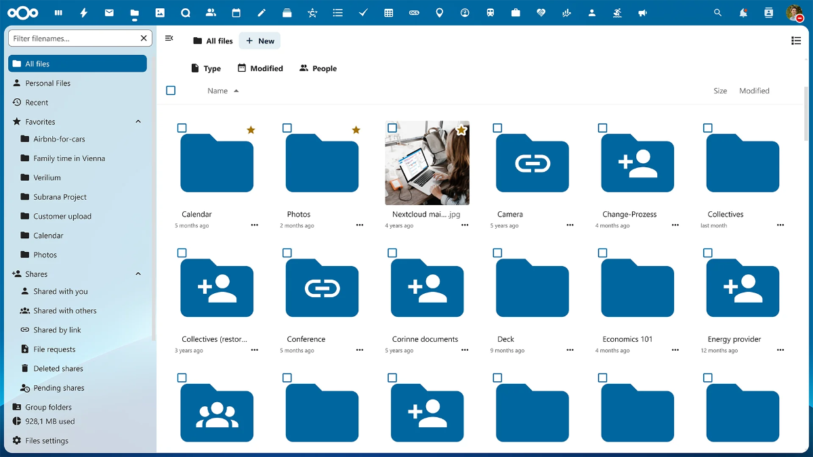

<!--
N.B.: This README was automatically generated by <https://github.com/YunoHost/apps/tree/master/tools/readme_generator>
It shall NOT be edited by hand.
-->

# Nextcloud for YunoHost

[](https://dash.yunohost.org/appci/app/nextcloud)  

[](https://install-app.yunohost.org/?app=nextcloud)

*[Read this README in other languages.](./ALL_README.md)*

> *This package allows you to install Nextcloud quickly and simply on a YunoHost server.*  
> *If you don't have YunoHost, please consult [the guide](https://yunohost.org/install) to learn how to install it.*

## Overview

Nextcloud Hub is a fully open-source on-premises content collaboration platform. Teams access, share and edit their documents, chat and participate in video calls and manage their mail and calendar and projects across mobile, desktop and web interfaces.

### YunoHost-specific features

In addition to Nextcloud core features, the following are made available with this package:

 * Integrate with YunoHost users and SSO - i.e. logout button
 * Allow one user to be the administrator (set at the installation)
 * Allow multiple instances of this application
 * Optionally access the user home folder from Nextcloud files (set at the installation, the sharing is enabled by default)
 * Serve `/.well-known` paths for CalDAV and CardDAV on the domain only if it's not already served - i.e. by Baïkal

### Oldstable branch

This branch is following old stable release because nextcloud first release are often not totally stable.

Please send your pull request to the [oldstable branch](https://github.com/YunoHost-Apps/nextcloud_ynh/tree/oldstable).

To try the oldstable branch, please proceed like that.

```
sudo yunohost app install https://github.com/YunoHost-Apps/nextcloud_ynh/tree/oldstable --debug
or
sudo yunohost app upgrade nextcloud -u https://github.com/YunoHost-Apps/nextcloud_ynh/tree/oldstable --debug
```


**Shipped version:** 27.1.10~ynh1

**Demo:** <https://demo.nextcloud.com/>

## Screenshots



## Documentation and resources

- Official app website: <https://nextcloud.com>
- Official user documentation: <https://docs.nextcloud.com/server/latest/user_manual/en/>
- Official admin documentation: <https://docs.nextcloud.com/server/stable/admin_manual/>
- Upstream app code repository: <https://github.com/nextcloud/server>
- YunoHost Store: <https://apps.yunohost.org/app/nextcloud>
- Report a bug: <https://github.com/YunoHost-Apps/nextcloud_ynh/issues>

## Developer info

Please send your pull request to the [`testing` branch](https://github.com/YunoHost-Apps/nextcloud_ynh/tree/testing).

To try the `testing` branch, please proceed like that:

```bash
sudo yunohost app install https://github.com/YunoHost-Apps/nextcloud_ynh/tree/testing --debug
or
sudo yunohost app upgrade nextcloud -u https://github.com/YunoHost-Apps/nextcloud_ynh/tree/testing --debug
```

**More info regarding app packaging:** <https://yunohost.org/packaging_apps>
