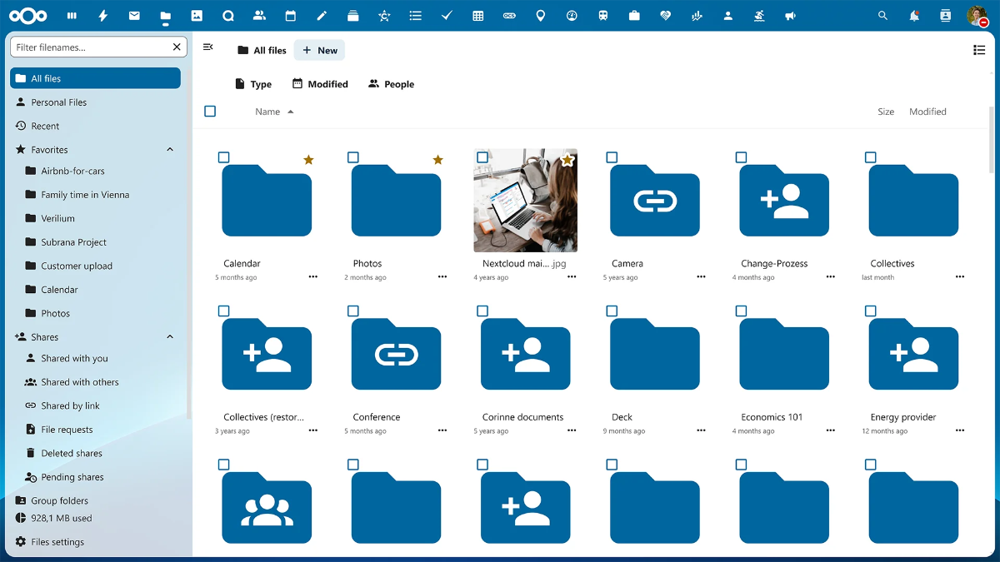

<!--
NOTA: Este README foi creado automáticamente por <https://github.com/YunoHost/apps/tree/master/tools/readme_generator>
NON debe editarse manualmente.
-->

# Nextcloud para YunoHost

[](https://ci-apps.yunohost.org/ci/apps/nextcloud/)  

[](https://install-app.yunohost.org/?app=nextcloud)

*[Le este README en outros idiomas.](./ALL_README.md)*

> *Este paquete permíteche instalar Nextcloud de xeito rápido e doado nun servidor YunoHost.*  
> *Se non usas YunoHost, le a [documentación](https://yunohost.org/install) para saber como instalalo.*

## Vista xeral

Nextcloud lets you access and synchronize data, files, contacts and calendars between different devices (PCs or mobiles), or share them with other people (with or without accounts), and also offers advanced communication and collaborative working features. Nextcloud features its own application mechanism (see also [Nextcloud's app store](https://apps.nextcloud.com/)) for specific functionalities. 

In the context of YunoHost, Nextcloud integrates with the SSO/User Portal (YunoHost accounts are automatically connected to Nextcloud).

The `/.well-known` address will be automatically configured for CalDAV and CardDAV synchronization if no other service such as Baïkal is already using it.

The YunoHost catalog has two collaborative office suites, [OnlyOffice](https://github.com/YunoHost-Apps/onlyoffice_ynh) and [Collabora](https://github.com/YunoHost-Apps/collabora_ynh), which can be integrated with Nextcloud.

**Versión proporcionada:** 29.0.9~ynh1

**Demo:** <https://demo.nextcloud.com/>

## Capturas de pantalla



## Documentación e recursos

- Web oficial da app: <https://nextcloud.com>
- Documentación oficial para usuarias: <https://docs.nextcloud.com/server/latest/user_manual/en/>
- Documentación oficial para admin: <https://docs.nextcloud.com/server/stable/admin_manual/>
- Repositorio de orixe do código: <https://github.com/nextcloud/server>
- Tenda YunoHost: <https://apps.yunohost.org/app/nextcloud>
- Informar dun problema: <https://github.com/YunoHost-Apps/nextcloud_ynh/issues>

## Info de desenvolvemento

Envía a túa colaboración á [rama `testing`](https://github.com/YunoHost-Apps/nextcloud_ynh/tree/testing).

Para probar a rama `testing`, procede deste xeito:

```bash
sudo yunohost app install https://github.com/YunoHost-Apps/nextcloud_ynh/tree/testing --debug
ou
sudo yunohost app upgrade nextcloud -u https://github.com/YunoHost-Apps/nextcloud_ynh/tree/testing --debug
```

**Máis info sobre o empaquetado da app:** <https://yunohost.org/packaging_apps>
